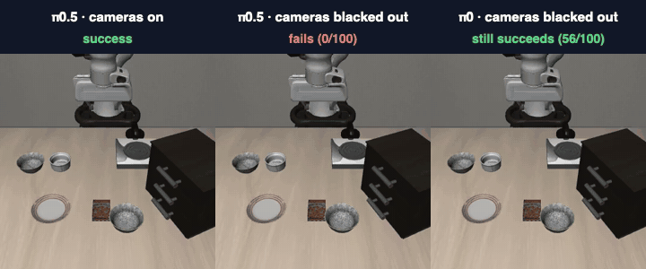
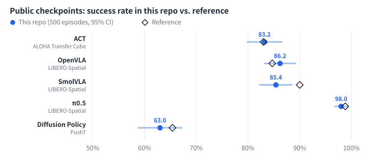
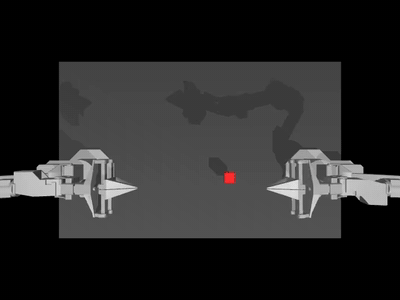
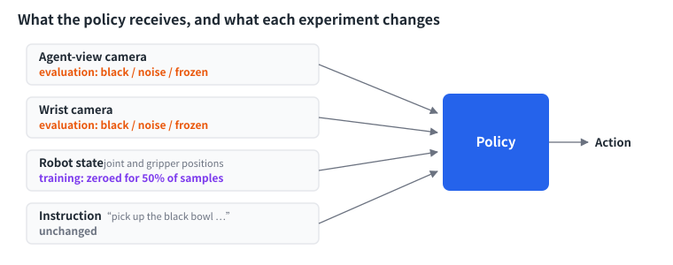
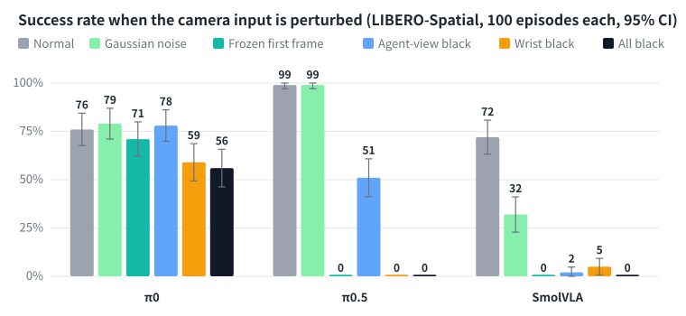
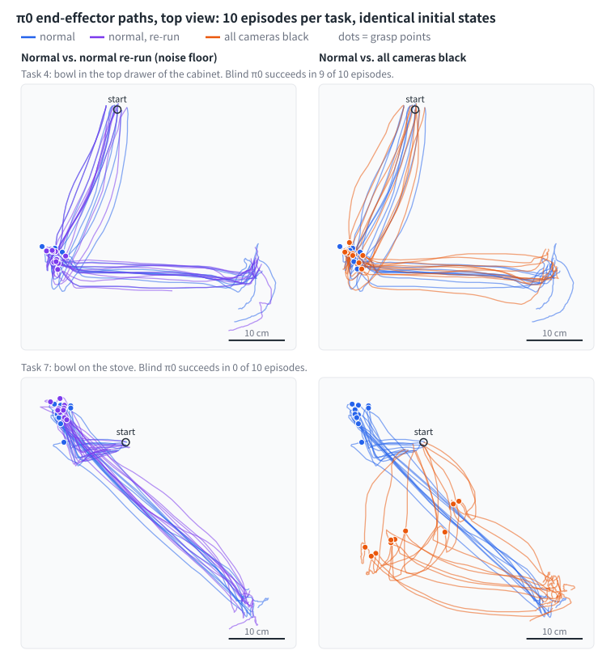

# Do robot policies actually use their cameras?

**Reproducing five open-source robot policies in simulation (four in MuJoCo, Diffusion Policy on 2-D PushT), then testing how much LIBERO policies rely on vision.**

[](https://github.com/chaoshengsc/robot-policy-sim-repro/actions/workflows/ci.yml)
[](LICENSE)
[](https://chaoshengsc.github.io/robot-policy-sim-repro/dashboard/)

English | [中文](README_CN.md)

<p align="center">
  
  <br><sub>Same task, same initial state. The videos show what happened in the simulator; in the two right-hand runs the policy itself received black images.</sub>
</p>

- **Reproduction.** ACT, OpenVLA, SmolVLA, π0.5 and Diffusion Policy reproduce their reference success rates within sampling error.
- **Vision dependence.** With every camera image replaced by black frames, π0.5, OpenVLA and SmolVLA drop to 0%. The public LeRobot π0 checkpoint still succeeds 56% of the time.
- **Why.** π0 shows no measurable dependence on the agent-view camera and loses little when the image is frozen. On the tasks it still solves blind, its path is as close to the sighted path as two sighted runs are to each other.

Everything runs on one workstation (RTX A5000 24 GB, Ubuntu 24.04, headless EGL rendering), with public checkpoints and wrapper scripts that leave upstream source untouched.

**Contents:** [Reproduction](#1-reproduction) · [Vision dependence](#2-do-the-policies-use-the-camera) · [Quick start](#quick-start) · [Layout](#repository-layout) · [Limitations](#limitations) · [Acknowledgements](#acknowledgements-and-licenses)

## 1. Reproduction



| Model | Task | This repo (500 episodes) | Reference | Reproduced |
|---|---|---|---|---|
| ACT | ALOHA Transfer Cube | **83.2%** | 83.0% (Hugging Face repo) | ✅ |
| OpenVLA | LIBERO-Spatial | **86.2%** | 84.7 ± 0.9% (official README) | ✅ |
| SmolVLA | LIBERO-Spatial | **85.4%** | 90% (paper, 100 episodes) | ✅ |
| π0.5 | LIBERO-Spatial | **98.0%** | 98.8% (OpenPI), 97.0% (LeRobot) | ✅ |
| Diffusion Policy | PushT (2-D, not MuJoCo) | **63.0%** | 65.4% (LeRobot model card) | ✅ |

The 95% confidence interval at 500 episodes is ±1–4 points. "Reproduced" means the intervals overlap. SmolVLA uses `lerobot/smolvla_libero` with `n_action_steps=10`; this checkpoint was trained on LIBERO-Spatial only, while the paper trains on all four LIBERO suites.

<p align="center"><br><sub>ACT on ALOHA Transfer Cube: the right arm picks up the cube and hands it to the left arm.</sub></p>

Per-task results are on the [dashboard](https://chaoshengsc.github.io/robot-policy-sim-repro/dashboard/). Replay videos are too large to publish; the dashboard plays them when the files are present locally. Sources of the reference numbers and the full experiment log are in [`docs/NOTES.md`](docs/NOTES.md).

## 2. Do the policies use the camera?

A LIBERO policy receives two camera images, the robot state (end-effector pose and gripper opening) and a language instruction. OpenVLA is the exception: it uses only the agent-view image and the instruction. Each experiment below changes the camera input.



All numbers in this section are success rates over 100 episodes (10 tasks × 10 initial states, same seed for every condition). The 95% confidence interval of a single number is up to ±10 points, so two conditions have to differ by about 13 points before the difference means anything. Episodes of one task are correlated, which makes these intervals optimistic.

Two of the checkpoints need a note:

- **π0** is LeRobot's public checkpoint `lerobot/pi0_libero_finetuned_v044`. Over 500 normal episodes it scores 73.4%, well below the 96.8% that an earlier OpenPI README gave for its own π0 fine-tuning run, and a LeRobot maintainer has said it is under-trained (lerobot issue #2114). OpenPI never released that π0 LIBERO checkpoint, so there is no official π0 checkpoint to compare against. What follows describes this checkpoint, not π0 in general.
- **SmolVLA** here is `HuggingFaceVLA/smolvla_libero` (75.2% over 500 episodes), not the checkpoint in section 1.

The Normal column is the first 10 episodes per task of each model's 500-episode run. Two more normal π0 runs, made for section 2.3, gave 73% and 76%.

### 2.1 Black out every camera

| Model | Normal | All cameras black |
|---|---|---|
| π0.5 | 99% | 0% |
| OpenVLA | 81% | 0% |
| SmolVLA | 72% | 0% |
| **π0** | 76% | **56%** |

Three models cannot act without images. π0 succeeds in 56% of episodes blind: 6 to 9 out of 10 on seven tasks, and 0 or 1 out of 10 on the other three. This matches the report in lerobot issue #3591.

### 2.2 Which camera, and what kind of perturbation?



| Model | Normal | Gaussian noise | Frozen first frame | Agent-view black | Wrist black | All black |
|---|---|---|---|---|---|---|
| π0 | 76% | 79% | 71% | 78% | 59% | 56% |
| π0.5 | 99% | 99% | 0% | 51% | 0% | 0% |
| SmolVLA | 72% | 32% | 0% | 2% | 5% | 0% |

- **π0** shows no measurable dependence on the agent-view camera (78% with it black, 76% normal) and barely needs a live image: with only the first frame for the whole episode it reaches 71%, within noise of normal. Losing the wrist camera (59%) costs about as much as losing both (56%).
- **π0.5** is closed-loop on vision. Noise does nothing, but a frozen image or a black wrist camera takes it to 0%.
- **SmolVLA** also needs a live image: a frozen first frame, which is a real, in-distribution image, takes it to 0%. It is sensitive to image quality as well. The noise that leaves π0 and π0.5 unchanged takes it to 32%.

Noise is Gaussian with standard deviation 0.1 on pixels in [0, 1].

### 2.3 Is blind π0 replaying a memorised trajectory?

The trajectories cannot tell, because on this benchmark sighted π0 moves almost the same way. The end-effector position was logged at every step and paths were compared with dynamic time warping, which removes speed differences.



Path difference per task, in cm (mean over 10 episodes with identical initial states). The success counts in the first row are from the blind run that logged these trajectories (54% overall), which is a separate run from the one in 2.1 (56%):

| | T0 | T1 | T2 | T3 | T4 | T5 | T6 | T7 | T8 | T9 |
|---|---|---|---|---|---|---|---|---|---|---|
| Blind π0 successes (of 10) | 7 | 8 | 9 | 7 | 9 | **3** | 6 | **0** | 5 | **0** |
| Normal vs. normal re-run | 0.3 | 0.2 | 0.1 | 0.0 | 2.1 | 6.6 | 3.1 | 2.6 | 3.0 | 3.3 |
| All black vs. normal | 2.6 | 2.7 | 2.7 | 2.5 | 2.3 | **6.0** | 3.1 | **10.9** | 3.8 | **7.8** |
| π0.5 vs. π0, both normal | 3.7 | 2.4 | 2.6 | 2.1 | 2.9 | 6.3 | 3.1 | 2.5 | 3.8 | 3.3 |

- **Where blind π0 succeeds, it moves like sighted π0.** On the seven tasks it solves at least half the time, its path differs from the sighted path by 2.8 cm and its grasp point by 2.4 cm. Two different models differ by 2.9 cm and 2.6 cm. Two runs of the same model differ by 3.4 cm and 2.4 cm (tasks 4–9).
- **Where it fails, it goes somewhere else.** On tasks 5, 7 and 9 the path differs by 6 to 11 cm.
- **The noise floor comes from tasks 4–9 only.** Re-runs of tasks 0–3 are almost identical because both runs use the same seed and had not yet diverged, so they say nothing about noise.

Averaged over all ten tasks, blind π0 looks twice as far from sighted π0 as the re-run does (4.4 cm vs. 2.1 cm). That average mixes the three failed tasks with four re-runs that are not independent, so it should not be read as "a different path".

What the data do show is how little the benchmark asks. Within a LIBERO-Spatial task, sighted π0's grasp point varies by about 1.8 cm across initial states, the same order as its run-to-run noise. A policy that tracks the bowl and a policy that repeats one motion per task would look alike here. Full per-task numbers are in [`results/trajectory.csv`](results/trajectory.csv).

## Quick start

```bash
export EMB_ROOT=/path/to/workdir      # environments, caches, checkpoints and logs all live here
# after installing the environments and downloading checkpoints (docs/INSTALL.md):
bash scripts/eval/run_act.sh          # ACT, 500 episodes, about 17 minutes on an RTX A5000
python3 scripts/analysis/summarize_eval.py act_cube_500
```

To regenerate the figures and tables in this README from the evaluation files in `dashboard/data/`, with no GPU and no dependencies:

```bash
python3 dashboard/build.py && python3 scripts/analysis/make_figures.py
```

| Document | Content |
|---|---|
| [`docs/INSTALL.md`](docs/INSTALL.md) | Step-by-step setup of the three conda environments, checkpoints, tokenizer |
| [`docs/TROUBLESHOOTING.md`](docs/TROUBLESHOOTING.md) | Every problem hit during setup and evaluation, with cause and fix |
| [`scripts/README.md`](scripts/README.md) | Which entry script and which summary script produce each result |
| [`env/lock/`](env/lock/) | Full package lists exported from the environments that produced the results |

## Repository layout

```
scripts/eval/      evaluation entry scripts; blackout, perturbation and trajectory-logging wrappers
scripts/train/     π0 fine-tuning with state zeroing (experiment recorded in docs/NOTES.md)
scripts/analysis/  metrics, summaries, figure generation
scripts/checks/    self-checks for GPU, headless EGL rendering and video decoding
results/           result tables (CSV) generated from dashboard/data, and the trajectories plotted in 2.3
dashboard/         results dashboard and the raw eval_info.json of every run
media/             figures and demos used in this README (Chinese versions in media/zh/)
docs/              installation, troubleshooting, reproduction notes
env/               environment file, pip constraints, exported package lists
tests/             unit tests for the metrics, consistency checks on the published numbers, entry-script regression tests
viewer/            replay a policy trajectory locally in the interactive MuJoCo viewer
```

## Limitations

- One benchmark suite (LIBERO-Spatial) and one seed. The scene varies little within a task, which is itself part of the finding in 2.3.
- The vision-dependence experiments use 100 episodes per condition, so differences under about 13 points are not meaningful.
- The π0 checkpoint is under-trained. A properly trained π0 may behave differently.
- The SmolVLA checkpoint in section 1 differs from the one in section 2.
- Diffusion Policy was evaluated on PushT (2-D physics), not in MuJoCo.

## Acknowledgements and licenses

This repository contains no model weights and no upstream source code. It builds on:

| Project | Used for | License |
|---|---|---|
| [LeRobot](https://github.com/huggingface/lerobot) v0.6.1 | ACT, Diffusion Policy, SmolVLA, π0, π0.5 evaluation and π0 fine-tuning | Apache-2.0 |
| [OpenVLA](https://github.com/openvla/openvla) | OpenVLA evaluation | MIT |
| [OpenPI](https://github.com/Physical-Intelligence/openpi) | π0 and π0.5 reference numbers | Apache-2.0 |
| [LIBERO](https://github.com/Lifelong-Robot-Learning/LIBERO) | benchmark | MIT |
| [Diffusion Policy](https://github.com/real-stanford/diffusion_policy), [ACT](https://github.com/tonyzhaozh/act) | original methods | MIT |
| [MuJoCo](https://github.com/google-deepmind/mujoco), [gym-aloha](https://github.com/huggingface/gym-aloha), [gym-pusht](https://github.com/huggingface/gym-pusht) | simulation | Apache-2.0 |

Checkpoints: `lerobot/act_aloha_sim_transfer_cube_human`, `openvla/openvla-7b-finetuned-libero-spatial`, `lerobot/smolvla_libero`, `HuggingFaceVLA/smolvla_libero`, `lerobot/pi05_libero_finetuned_v044`, `lerobot/pi0_libero_finetuned_v044`, `lerobot/diffusion_pusht`. Exact commits are in [`results/reproduction.csv`](results/reproduction.csv) and [`docs/NOTES.md`](docs/NOTES.md). Each checkpoint has its own license. The π0 tokenizer comes from the gated `google/paligemma-3b-pt-224` repository under the Gemma terms and is not included.

Papers: [ACT](https://arxiv.org/abs/2304.13705) · [Diffusion Policy](https://arxiv.org/abs/2303.04137) · [OpenVLA](https://arxiv.org/abs/2406.09246) · [LIBERO](https://arxiv.org/abs/2306.03310) · [SmolVLA](https://arxiv.org/abs/2506.01844) · [π0](https://arxiv.org/abs/2410.24164) · [π0.5](https://arxiv.org/abs/2504.16054)

## Citation

See [`CITATION.cff`](CITATION.cff), or use GitHub's "Cite this repository" button.
