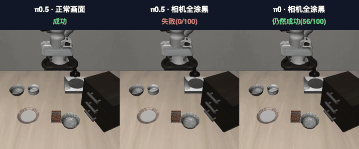
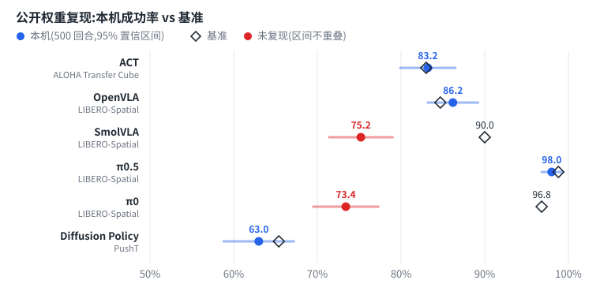
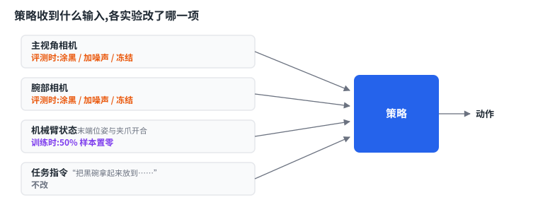
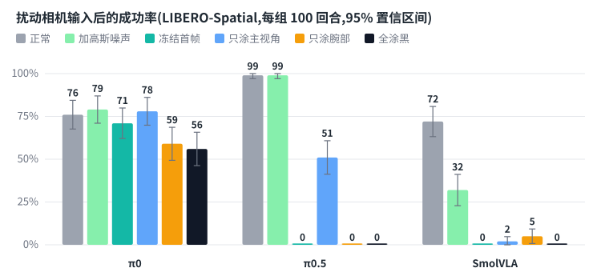
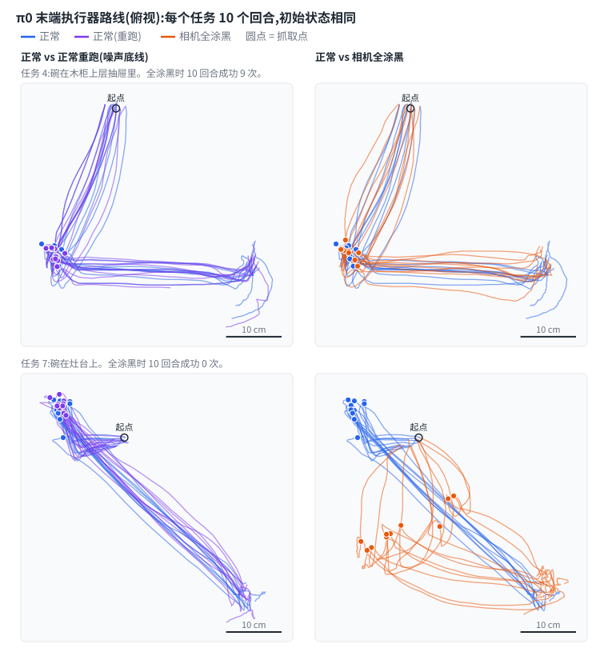

# 机器人策略真的在看画面吗?

**在仿真中复现 6 个开源机器人策略(5 个在 MuJoCo,Diffusion Policy 在 2D 的 PushT),再测试每个策略有多依赖视觉。**

[](https://github.com/chaoshengsc/robot-policy-sim-repro/actions/workflows/ci.yml)
[](LICENSE)
[](https://chaoshengsc.github.io/robot-policy-sim-repro/dashboard/?lang=zh)

[English](README.md) | 中文

<p align="center">
  
  <br><sub>同一任务、同一初始状态。视频是仿真器里实际发生的情况;右边两次运行中,策略收到的是全黑图像。</sub>
</p>

- **复现。** ACT、OpenVLA、π0.5、Diffusion Policy 的成功率复现到基准的抽样误差范围内;π0 和 SmolVLA 的公开权重没有(73% 对 97%,75% 对 90%)。
- **视觉依赖。** 把所有相机画面换成全黑后,π0.5、OpenVLA、SmolVLA 降到 0%,π0 仍有 56%。
- **原因。** π0 对主视角相机测不出依赖,画面冻结后也只小幅下降。在它看不见仍能完成的任务上,它走的路线和看得见时的差别,不比两次正常运行之间的差别大。微调时把机械臂状态随机置零,全涂黑的成功率从 61% 降到 40%。

全部在一台工作站上完成(RTX A5000 24 GB,Ubuntu 24.04,EGL 无头渲染),只用公开权重;所有改动都是包装脚本,不改上游源码。

**目录:** [复现结果](#1-复现结果) · [视觉依赖](#2-策略有没有在用相机) · [快速开始](#快速开始) · [仓库结构](#仓库结构) · [局限](#局限) · [致谢与许可证](#致谢与许可证)

## 1. 复现结果



| 模型 | 任务 | 本仓库(500 回合) | 基准 | 是否复现 |
|---|---|---|---|---|
| ACT | ALOHA Transfer Cube | **83.2%** | 83.0%(Hugging Face 仓库) | ✅ |
| OpenVLA | LIBERO-Spatial | **86.2%** | 84.7 ± 0.9%(官方 README) | ✅ |
| π0.5 | LIBERO-Spatial | **98.0%** | 98.8%(OpenPI),97.0%(LeRobot) | ✅ |
| Diffusion Policy | PushT(2D,非 MuJoCo) | **63.0%** | 65.4%(LeRobot 模型卡) | ✅ |
| SmolVLA | LIBERO-Spatial | 75.2% | 90%(论文) | ❌ |
| π0 | LIBERO-Spatial | 73.4% | 96.8%(OpenPI) | ❌ |

500 回合的 95% 置信区间为 ±1–4 个百分点。"复现"指两个区间有重叠。

<p align="center"><br><sub>ACT · ALOHA Transfer Cube:右臂抓起方块交给左臂。</sub></p>

两个没复现的原因:

- **π0。** 基准数字是 OpenPI 自己训练的权重。这里用的 LeRobot 公开权重训练不足(维护者已确认),社区对同一权重的实测也是 73%。
- **SmolVLA。** 公开权重和论文的结构不同(expert 宽度 0.5、VLM 32 层,论文是 0.75、16 层)。社区对同一权重的实测约 82%;这里的结果仍比它低 7 个百分点,原因还没找到。batch size 和 `n_action_steps` 已排除。

π0 的 `n_action_steps` 取 5、10、50 时,成功率分别是 76%、70%、68%(各 100 回合),差异在误差内。

各任务明细在[看板](https://chaoshengsc.github.io/robot-policy-sim-repro/dashboard/?lang=zh)上(回放视频体积大,没有发布;本地有视频文件时看板可以播放);基准出处与排查过程见 [`docs/NOTES.md`](docs/NOTES.md)。

## 2. 策略有没有在用相机?

LIBERO 上的策略收到两路相机画面、机械臂状态(末端位姿与夹爪开合)和一句任务指令。OpenVLA 例外,它只用主视角画面和指令。下面每个实验只改其中一项输入。



本节所有数字都是 100 回合的成功率(10 个任务 × 10 个初始状态,各条件用同一个种子)。单个数字的 95% 置信区间最宽约 ±10 个百分点,所以两个条件要相差约 13 个百分点以上才有意义。同一任务的回合彼此相关,这些区间是偏乐观的。

"正常"一列取自第 1 节 500 回合评测里每个任务的前 10 回合,所以和那张表略有出入。为 2.3 节另外跑的两次 π0 正常评测分别是 73% 和 76%。

### 2.1 把所有相机涂黑

| 模型 | 正常 | 全涂黑 |
|---|---|---|
| π0.5 | 99% | 0% |
| OpenVLA | 81% | 0% |
| SmolVLA | 72% | 0% |
| **π0** | 76% | **56%** |

三个模型没有画面就完全不能动作。π0 看不见时仍有 56% 的回合成功:七个任务 10 次里成功 6–9 次,另外三个任务只成功 0–1 次。这与 lerobot issue #3591 的报告一致。

### 2.2 是哪一路相机,什么样的扰动?



| 模型 | 正常 | 加高斯噪声 | 冻结首帧 | 只涂主视角 | 只涂腕部 | 全涂黑 |
|---|---|---|---|---|---|---|
| π0 | 76% | 79% | 71% | 78% | 59% | 56% |
| π0.5 | 99% | 99% | 0% | 51% | 0% | 0% |
| SmolVLA | 72% | 32% | 0% | 2% | 5% | 0% |

- **π0** 对主视角相机测不出依赖(涂黑后 78%,正常 76%),也几乎不需要实时画面:整个回合只给它第一帧时是 71%,和正常的差别在误差内。只涂腕部相机(59%)和两路全涂(56%)的损失差不多。
- **π0.5** 对视觉是闭环的:加噪声没有影响,但画面冻结或腕部相机涂黑都会降到 0%。
- **SmolVLA** 同样需要实时画面:冻结首帧是真实的、分布内的画面,它照样降到 0%。它对画质也敏感,π0 和 π0.5 不受影响的噪声让它降到 32%。

噪声是标准差 0.1 的高斯噪声,像素范围 [0, 1]。

### 2.3 看不见的 π0 是在背轨迹吗?

靠轨迹分不出来,因为在这个基准上,看得见的 π0 走的也几乎是同一条路线。评测时逐步记录了末端执行器位置,用动态时间规整(DTW)比较路线,消除了快慢差异。



各任务的路线差异,单位 cm(10 个回合的平均,初始状态相同)。第一行的成功次数来自记录轨迹的那次全涂黑评测(总计 54%),和 2.1 的那次(56%)是两次独立运行:

| | 任务 0 | 1 | 2 | 3 | 4 | 5 | 6 | 7 | 8 | 9 |
|---|---|---|---|---|---|---|---|---|---|---|
| 全涂黑时成功次数(/10) | 7 | 8 | 9 | 7 | 9 | **3** | 6 | **0** | 5 | **0** |
| 正常 vs 正常重跑 | 0.3 | 0.2 | 0.1 | 0.0 | 2.1 | 6.6 | 3.1 | 2.6 | 3.0 | 3.3 |
| 全涂黑 vs 正常 | 2.6 | 2.7 | 2.7 | 2.5 | 2.3 | **6.0** | 3.1 | **10.9** | 3.8 | **7.8** |
| π0.5 vs π0,都正常 | 3.7 | 2.4 | 2.6 | 2.1 | 2.9 | 6.3 | 3.1 | 2.5 | 3.8 | 3.3 |

- **看不见仍能成功的任务上,路线和看得见时一样。** 在全涂黑后成功率不低于一半的七个任务上,路线相差 2.8 cm,抓取点相差 2.4 cm。两个不同模型之间是 2.9 cm 和 2.6 cm,同一模型两次运行之间是 3.4 cm 和 2.4 cm(任务 4–9)。
- **失败的任务上,它去了别的地方。** 任务 5、7、9 的路线相差 6–11 cm。
- **噪声底线只能看任务 4–9。** 任务 0–3 的两次运行几乎完全重合,因为两次用的是同一个种子、还没有分叉,不能反映噪声。

十个任务一起平均,全涂黑与正常的差异(4.4 cm)是重跑差异(2.1 cm)的两倍。这个平均值混进了三个失败的任务和四个并不独立的重跑,不能据此说"走的是另一条路线"。

数据真正说明的是这个基准要求很低:LIBERO-Spatial 同一任务内,看得见的 π0 在不同初始状态下的抓取点只相差约 1.8 cm,和它两次运行之间的噪声同一量级。一个跟着碗走的策略,和一个每个任务只重复一套动作的策略,在这里看起来是一样的。完整的分任务数字见 [`results/trajectory.csv`](results/trajectory.csv)。

### 2.4 训练能让 π0 去看画面吗?

从公开的 π0 权重继续训练 3000 步(batch 16,只训动作专家,约为原训练量的 15%)。改动组训练时对 50% 的样本把 `observation.state` 置零。

| 模型 | 正常 | 全涂黑 |
|---|---|---|
| 原始 π0 | 76% | 56% |
| 继续微调,对照组 | 78% | 61% |
| 继续微调,状态置零 | 68% | **40%** |

状态置零让全涂黑的成功率从 61% 降到 40%(z ≈ 3.0,p ≈ 0.003)。正常成功率也降了,从 78% 到 68%(p ≈ 0.11,不显著)。涂黑带来的额外下降是 11 个百分点(对照组掉 17,置零组掉 28),在这个样本量下处于显著的边缘(按任务配对,t ≈ 2.2,p ≈ 0.06)。两组各只训练了一次。

这个结果与"模型变得更依赖视觉"相符,但还不足以确立。第一次去掉状态时训练损失从 0.145 跳到 0.835,提示原来的 π0 对这项输入依赖很重。

## 快速开始

```bash
export EMB_ROOT=/path/to/workdir      # 环境、缓存、权重、日志都放这里
# 按 docs/INSTALL.md 装好环境并下载权重后:
bash scripts/eval/run_act.sh          # ACT,500 回合,RTX A5000 上约 17 分钟
python3 scripts/analysis/summarize_eval.py act_cube_500
```

从 `dashboard/data/` 里的评测文件重新生成本页的图和表(不需要 GPU,不需要装任何依赖):

```bash
python3 dashboard/build.py && python3 scripts/analysis/make_figures.py
```

| 文档 | 内容 |
|---|---|
| [`docs/INSTALL.md`](docs/INSTALL.md) | 三个 conda 环境、权重、分词器的逐步安装 |
| [`docs/TROUBLESHOOTING.md`](docs/TROUBLESHOOTING.md) | 安装和评测中遇到的每个问题:现象、原因、解决 |
| [`scripts/README.md`](scripts/README.md) | 每个结果对应哪个入口脚本和汇总脚本 |
| [`env/lock/`](env/lock/) | 从实际跑出结果的环境导出的完整包清单 |

## 仓库结构

```
scripts/eval/      评测入口;涂黑、扰动、轨迹记录的包装脚本
scripts/train/     π0 状态置零微调与全自动流水线
scripts/analysis/  指标、汇总、出图
scripts/checks/    GPU、EGL 无头渲染、视频解码自检
results/           由 dashboard/data 生成的结果表(CSV),以及 2.3 节画图用的轨迹
dashboard/         结果看板,以及每次评测的原始 eval_info.json
media/             本页用的图与演示(中文版在 media/zh/)
docs/              安装、排查、复现笔记
env/               环境文件、pip 约束、导出的包清单
tests/             指标的单元测试、已发布数字的一致性检查、入口脚本的回归测试
viewer/            在本地用 MuJoCo 交互查看器回放策略轨迹
```

## 局限

- 只用了一个基准套件(LIBERO-Spatial)和一个种子。同一任务内场景变化很小,这本身就是 2.3 的发现之一。
- 视觉依赖实验每个条件 100 回合,约 13 个百分点以内的差异没有意义。
- π0 的公开权重训练不足,训练充分的 π0 表现可能不同。
- SmolVLA 与社区数字的差距原因未明。
- 2.4 的微调训练量小,只训了动作专家,且每组只训练了一次。
- Diffusion Policy 评测的是 PushT(2D 物理),不在 MuJoCo 里。

## 致谢与许可证

本仓库不包含任何模型权重,也不包含上游源码。它建立在这些项目之上:

| 项目 | 用途 | 许可证 |
|---|---|---|
| [LeRobot](https://github.com/huggingface/lerobot) v0.6.1 | ACT、Diffusion Policy、SmolVLA、π0、π0.5 的评测与 π0 微调 | Apache-2.0 |
| [OpenVLA](https://github.com/openvla/openvla) | OpenVLA 评测 | MIT |
| [OpenPI](https://github.com/Physical-Intelligence/openpi) | π0、π0.5 的基准数字 | Apache-2.0 |
| [LIBERO](https://github.com/Lifelong-Robot-Learning/LIBERO) | 基准 | MIT |
| [Diffusion Policy](https://github.com/real-stanford/diffusion_policy)、[ACT](https://github.com/tonyzhaozh/act) | 原始方法 | MIT |
| [MuJoCo](https://github.com/google-deepmind/mujoco)、[gym-aloha](https://github.com/huggingface/gym-aloha)、[gym-pusht](https://github.com/huggingface/gym-pusht) | 仿真 | Apache-2.0 |

权重:`lerobot/act_aloha_sim_transfer_cube_human`、`openvla/openvla-7b-finetuned-libero-spatial`、`HuggingFaceVLA/smolvla_libero`、`lerobot/pi05_libero_finetuned_v044`、`lerobot/pi0_libero_finetuned_v044`、`lerobot/diffusion_pusht`,具体 commit 见 [`results/reproduction.csv`](results/reproduction.csv)。各权重有自己的许可证。π0 的分词器来自受限仓库 `google/paligemma-3b-pt-224`,受 Gemma 条款约束,本仓库不包含。

论文:[ACT](https://arxiv.org/abs/2304.13705) · [Diffusion Policy](https://arxiv.org/abs/2303.04137) · [OpenVLA](https://arxiv.org/abs/2406.09246) · [LIBERO](https://arxiv.org/abs/2306.03310) · [SmolVLA](https://arxiv.org/abs/2506.01844) · [π0](https://arxiv.org/abs/2410.24164) · [π0.5](https://arxiv.org/abs/2504.16054)

## 引用

见 [`CITATION.cff`](CITATION.cff),或用 GitHub 页面上的 "Cite this repository" 按钮。
